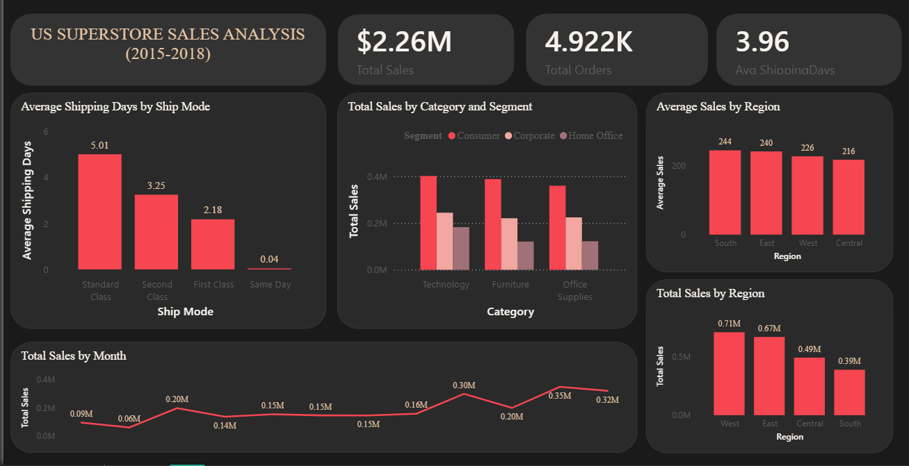

# US Superstore Sales Analysis (2015–2018)

## Overview
Exploratory data analysis of the Superstore sales dataset, covering shipping performance,
regional sales patterns, seasonal trends, and category/segment breakdowns. Built end-to-end:
cleaning, analysis, and an interactive Power BI dashboard.

**Note:** This is a static, historical dataset (2015–2018 snapshot). No live data source —
cleaned and loaded via Power Query, consistent with the fixed nature of the source file.

## Data Cleaning
1. Converted Order Date and Ship Date from text to proper datetime format, enabling date-based analysis

2. Investigated 11 rows with missing Postal Code — traced to a known gap in the source data for Burlington, VT records — filled with the correct ZIP (05401) rather than dropping the rows or guessing

3. Investigated apparent outliers in Sales (max value ~100x the median) — confirmed these were legitimate high-value Technology purchases (copiers, videoconferencing systems), not data errors

4. Investigated a Product Name/Product ID count mismatch — confirmed this reflects multiple real SKU variants sharing a generic product name
(eg, 10 different "Staples" products), not a data quality issue.

## Business Questions Answered
1. How does shipping time vary by ship mode, and what's driving the overall average?
2. How do regions compare on sales volume vs. average order value?
3. What seasonal patterns exist in monthly sales?
4. How do sales break down by category and customer segment?

## Key Findings
1. Shipping speed is driven entirely by Ship Mode, not geography or product type. Standard Class orders take ~5 days on average versus ~0.04 days for Same Day — over a 100x difference. Region and product category showed negligible variation (under 4 hours difference between fastest and slowest), meaning shipping delays are a service-tier issue, not a logistics/regional bottleneck.

2. The West region leads in total sales, but this is a volume story, not a value story. West generates the highest total sales ($710K) primarily through order volume (3,140 orders) — its average transaction size ($226) is actually the second-lowest of all four regions. South, despite having the fewest orders (1,598), has the highest average sale value ($244), suggesting a smaller but higher-spending customer base.

3. Sales show consistent annual seasonality layered on strong year-over-year growth. Every year dips in January–February and peaks in November–December — a clear four-year repeating pattern. Beneath that seasonal rhythm, the business grew substantially: the November 2018 peak (~$118K) is roughly 8x the lowest point recorded in early 2015 (~$5K).

4. Consumer is the dominant segment and Technology the leading category — consistently, with no interaction effect. Consumer sales exceed Corporate and Home Office in every single product category, and Technology leads every segment. This means category strategy doesn't need to be segment-specific; the same priorities hold across all customer types.

## What I'd do differently / extend next
1. This dataset lacks Profit and Quantity columns — with them, I'd check whether West's high sales volume translates to proportionally high profit, or whether high-volume/lower-value orders erode margin

2. Build a year-over-year overlay chart to isolate the seasonal shape from the growth trend more cleanly

3. Investigate what's driving South's higher average order value — product mix, customer type, or fewer but larger bulk purchases

## Tools
Python (pandas, numpy) for cleaning · Power BI for visualization and dashboarding

## Dashboard

## Files
- `superstore_eda.ipynb` — data cleaning and prep
- `Superstore_Dashboard.pbix`[https://github.com/keshav2007-ctrl/DS-DA-Journey/blob/main/Projects/Project4_eda/Superstore_Dashboard.pbix] — Power BI dashboard file
- `dashboard_screenshot.png` — static preview image
